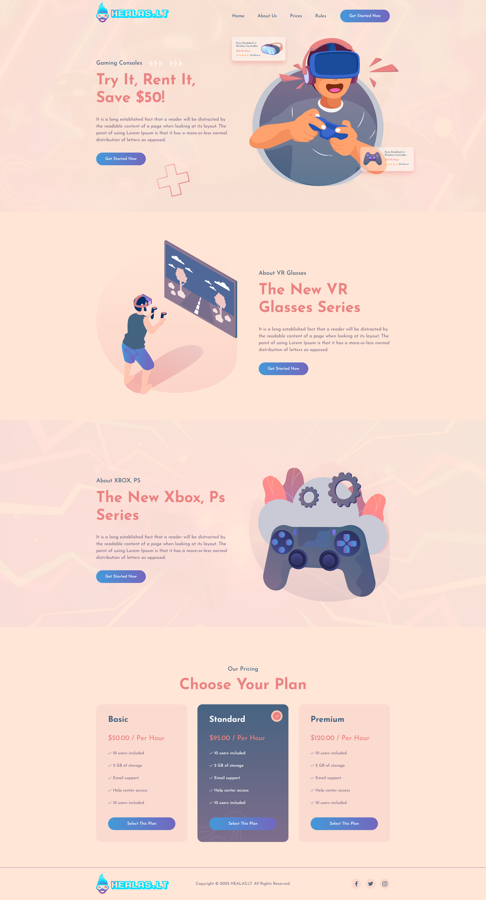
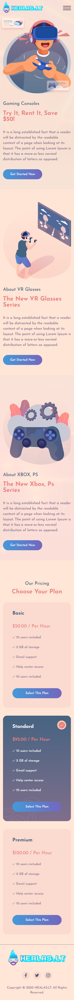
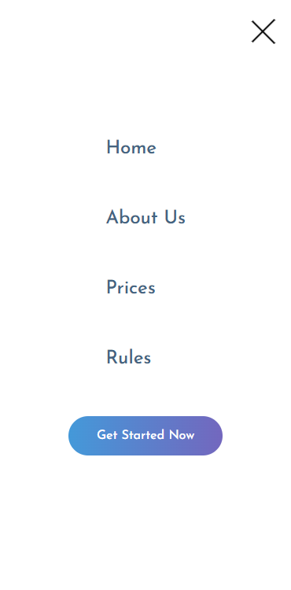

# Gogame

## 📜 Лицензия
Этот проект распространяется под лицензией **MIT**.  
Подробнее см. [LICENSE](LICENSE).

### Ссылка на сайт
[Ссылка на сайт где вы можете увидеть все анимации!](https://blackdarkes.github.io/Gogames/ "Перейти к сайту")

**Описание проекта**: Gogame — это сайтпро VR индустрию с анимациями, он написан на react(TypeScript). На данном сайте анимирован почти каждый из блоков, а именно шапка сайта при прокрутке у неё появляется задний фон, первый блок с анимацией появления и крутящимся крестиком, второй блок с плавной покачивающейся анимацией и третий блок где крутятся шестеренки и также плавно качается геймпад, что 
делает его более привлекательным и современным. Сайт адаптирован под различные устройства и размеры экранов.
[](https://opensource.org/licenses/MIT)
[](https://reactjs.org) 

### Функционал

- Просмотр афиш.
- Онлайн покупка билетов.
- Информация о театре.
- Список новостей.

### Технологии

- **Frontend**: React 18, TypeScript, Framer motion, gh-pages, React Router 6, React Query, Axios, Vite, SCSS, SVGR.
  [](https://reactjs.org/)  
  [](https://www.typescriptlang.org/)  
  [](https://www.framer.com/motion/)
  [](https://github.com/tschaub/gh-pages)
  [](https://reactrouter.com/)  
  [](https://tanstack.com/query/latest/)  
  [](https://axios-http.com/)  
  [](https://vitejs.dev/)  
  [](https://sass-lang.com/)  
  [](https://react-svgr.com/)  
  [](https://feature-sliced.design/) 
- **Дизайн**: Figma.
  [](https://figma.com/)

### Установка

1. Клонирование репозитория:

   ```bash
   git clone https://github.com/BlackDarkes/Gogames.git

   ```

2. Запустите проект:
   
    Node.js >= 18.x
    npm >= 9.x
   ```bash
    npm install && npm run dev
   ```

### Пример кода
```TypeScript
 import type { ReactNode } from "react";
 import styles from './Container.module.scss'

 interface IContainerProps {
   children: ReactNode;
   className?: string;
 }
   
 export const Container = ({ children, className }: IContainerProps) => {
   return (
     <div className={`${styles.container} ${className}`}>{children}</div>
   );
 }
```

### Структура проекта:
     project/  
     ├── public/       
     ├── src/        
     ├── vite.config.ts        
     ├── tsconfig       
     ├── README.md   
     └── LICENSE.md   

## Изображения проекта:
1. **Desktop изображения:**
  
  *Рис. 1: Главная страница сайта в десктопной версии.*

1. **Mobile изображения:**
   
   

   *Рис. 2: Главная страница сайта в мобильной версии.*

   

   *Рис. 3: Бургер меню.*